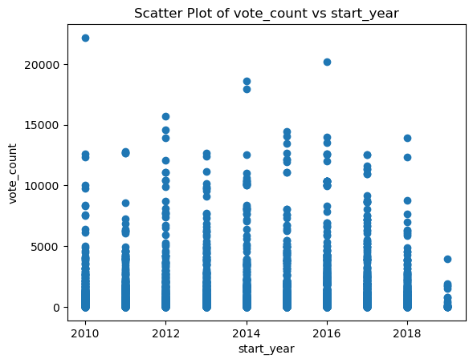
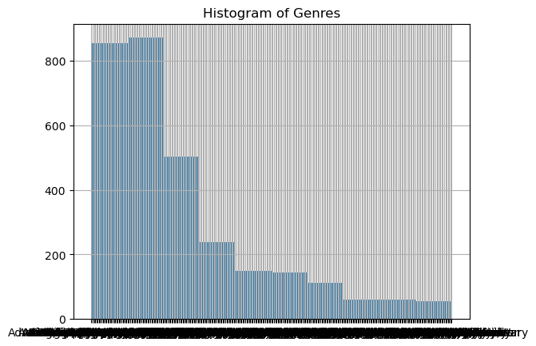
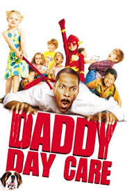
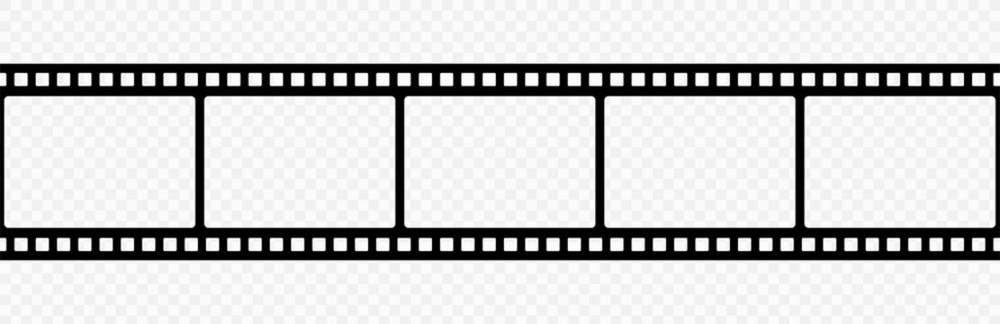

# My README.md file

## Overview 

### Exploring the Film Industry: Insights for Our New Movie Studio"

Understanding what types of films are currently doing well at the box office

Image: <img src=

## Business Understanding
### Our Goal

    •	Create a new movie studio
    •	Produce films that resonate with audiences
    •	Understand current market trends
 Image: <img src= 

## Data Understanding
### Our Data

    •	Movie data from ['im.db','bom.movies_gross.csv']
    •	Includes information on genre, studio,     popularity, vote average, and more
    •	Over [3,042] movies analyzed
    
    link to my data visualizations on tableau: https://public.tableau.com/app/profile/martin.ogutu/viz/Presentation2_17222521439550/Dashboard1?publish=yes

 Image: <img src=

## Data Analysis
   What We Found

    •	Top 10 genres by average vote count
    •	Relationship between popularity and vote average
    •	Genre distribution by studio
    •	Trend of vote average over time
   Image: <img src=

     Tableau visualizations: https://public.tableau.com/app/profile/martin.ogutu/viz/Presentation2_17222521439550/Dashboard1?publish=yes

## Recommendation
  Our Recommendation

    •	Focus on producing films in the top 10 genres by average vote count (e.g. action, comedy, drama)
    •	Prioritize films with high popularity and vote average (e.g. blockbuster franchises)
    •	Consider partnering with studios that produce successful films in our target genres
    •	Monitor trends in vote average over time to adjust our strategy
   Image: <img src=

## Next Steps

    •	Conduct further research on target genres and studios
    •	Develop a content strategy based on our findings
    •	Establish partnerships with studios and talent
    •	Monitor and adjust our strategy as needed
  
## Thank You
 "Thank you for your attention. We hope our insights will help inform your decisions as we launch our new movie studio."
   Image: <img src=

•	Prompt for questions: "Do you have any questions?"

•	Contact information: "Name: [Your Name], LinkedIn: [Your LinkedIn Profile]"

